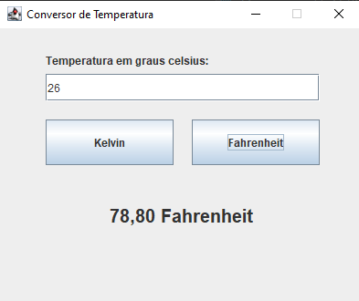

# CONVERSOR DE TEMPERATURA

Este é um aplicativo simples de conversão de temperaturas feito em Java, utilizando a biblioteca **Swing**.  
Ele permite converter temperaturas de **Celsius** para **Kelvin** ou **Fahrenheit**.

## Tecnologias

* Java 21
* Swing

## Autor

[Guilherme Moreira](https://www.linkedin.com/in/guilherme-moreira-08a8b8348/)